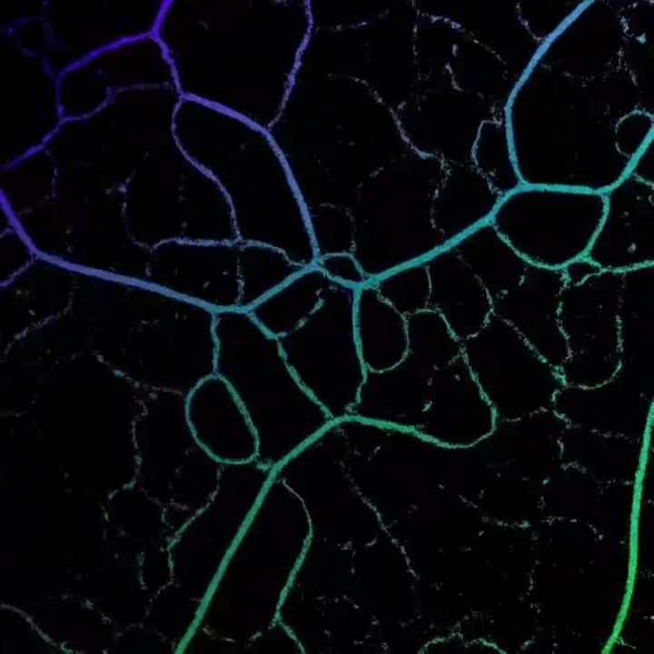
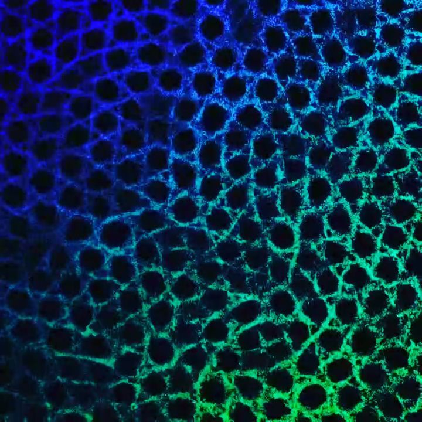

# Physarum Audio Reactive
A slime mold simulation made by nicoptere and modified by bu3nAmigue for audio reactivity

Inspired by this [amazing work ](https://www.sagejenson.com/physarum). Implemented from [this paper](http://eprints.uwe.ac.uk/15260/1/artl.2010.16.2.pdf)

You can check a sample of this audio reactive modification [here](https://www.instagram.com/p/B6ytj5rlUMf/?utm_source=ig_web_copy_link).

The model has these parameters:
- SA and RA control the changes in direction ( Sensor Angle and Rotation Angle)
- SO and SS are the look ahead distance and step size (speed) respectively.
- radius controls the size of the particle stream when drawing 
- count controls the particle count when drawing 

## Usage

> `npm install`

> `npm run dev`

To use the mic check the branc "mic" of this repository, by default it loads this [mp3](https://github.com/bu3nAmigue/physarum-audio-reactive/blob/master/src/song.mp3) file instead of using the microphone.

## Sample Images

